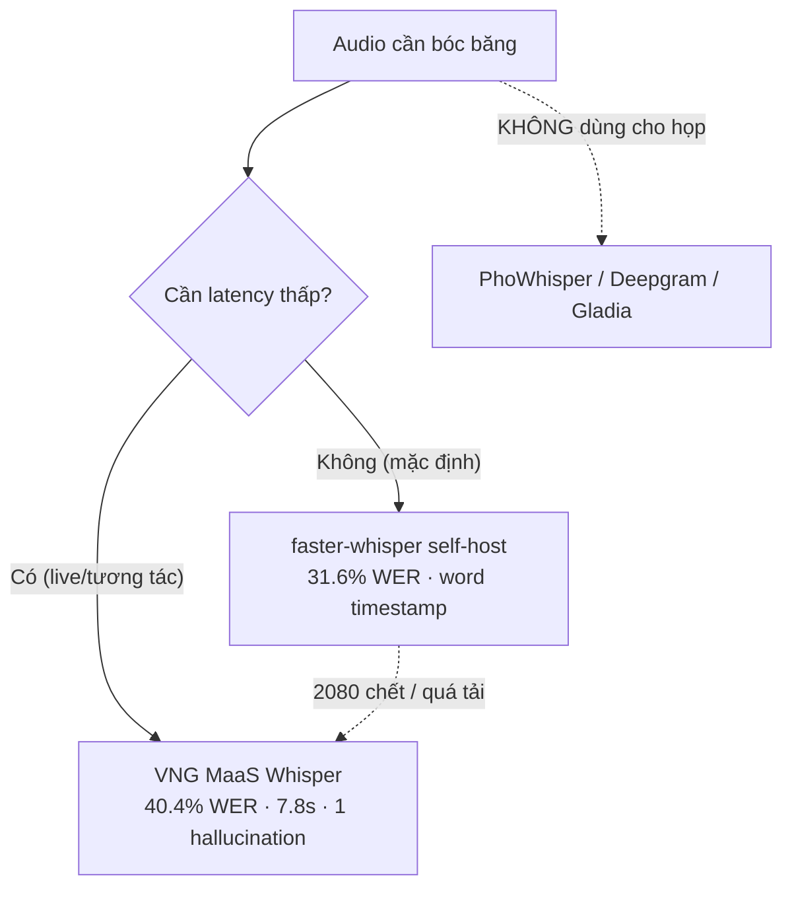
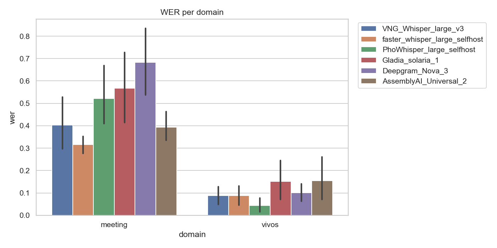
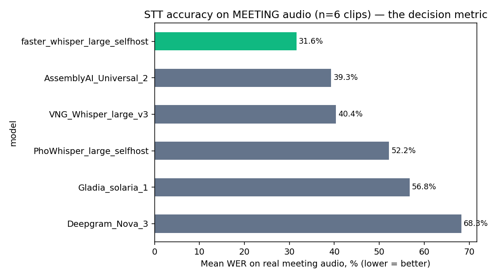
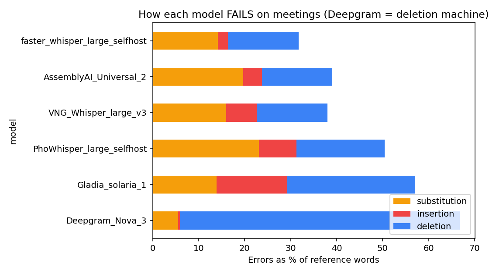
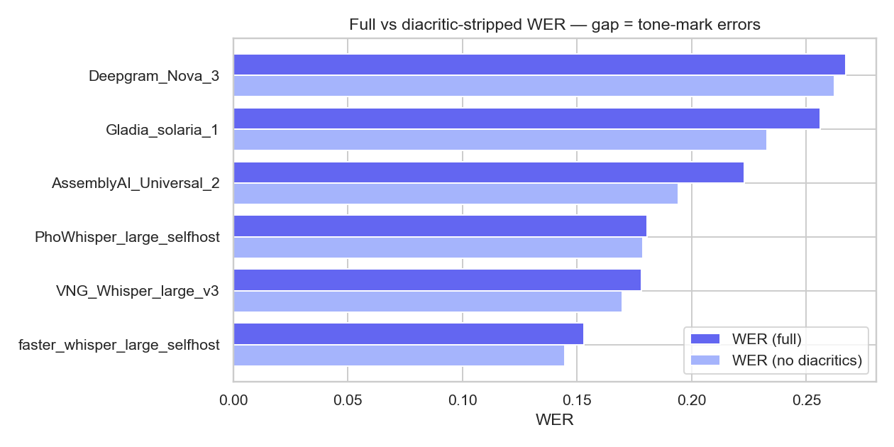
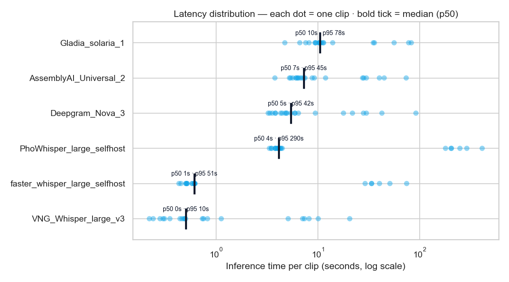
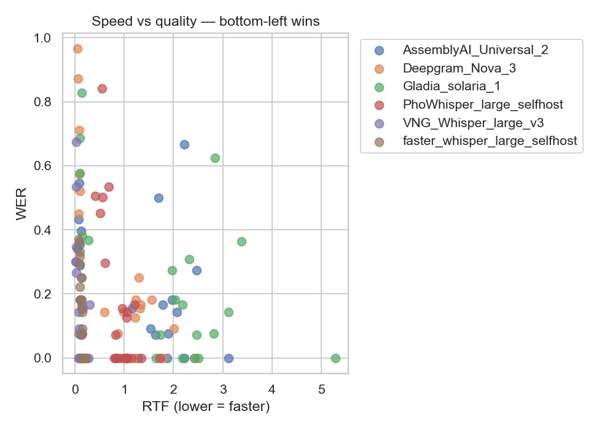
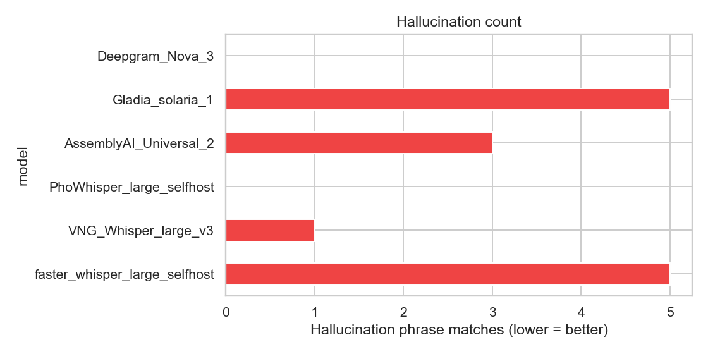

# Phân tích Benchmark STT — Mee Meeting Agent

> Chọn engine speech-to-text nào cho Mee để bóc băng cuộc họp tiếng Việt?
> **Ngày**: 2026-06-16 · **Corpus**: 21 clip/model (15 VIVOS đọc rõ + 6 họp thật) ·
> **Công cụ**: [`benchmarks/`](../../benchmarks/) (`run.py` → `analyze.py`)
>
> *(Bản tóm tắt auto do máy sinh: `benchmarks/results/REPORT.md`. File này là
> bản phân tích đầy đủ, có giải thích + nhận xét.)*

---

## Kết luận nhanh (TL;DR)

**Dùng faster-whisper (large-v3) self-host trên 2080 làm STT chính cho Mee.**
Trên audio họp thật nó chính xác nhất (**WER 31.6%**), vượt VNG MaaS Whisper
(40.4%) và mọi API thương mại. Chạy trên GPU của mình, không phụ thuộc MaaS, và
trả về word-level timestamp cho player kiểu Notta.

- **Chính**: faster-whisper self-host — chính xác nhất trên họp + có word timestamp + GPU riêng.
- **Dự phòng (latency thấp)**: VNG MaaS Whisper — nhanh gấp 5× (7.8s so với 37s), ít hallucination nhất (1), độ chính xác kém một bậc.
- **Loại cho họp**: PhoWhisper (52% + cực chậm), Deepgram (68%, nuốt 60% số chữ), Gladia (57%).
- ⚠️ Cần xử lý trước khi chốt: faster-whisper hallucination trên 5/6 clip họp (chỉnh VAD — xem *Rủi ro*).



---

## Hiểu các chỉ số (đọc mục này trước khi xem biểu đồ)

Mỗi cặp (model × clip) được chấm bằng bộ chỉ số dưới đây. **Tất cả đều "càng
thấp càng tốt"**, trừ WIP / hits / len_ratio.

| Chỉ số | Là gì | Đọc thế nào |
|---|---|---|
| **WER** (Word Error Rate) | Tỉ lệ lỗi từ = (số từ Sai + Thừa + Thiếu) / tổng số từ trong bản chuẩn. Chỉ số "đầu bảng" của STT. | 0% = hoàn hảo. 30% = cứ 10 từ sai ~3. >50% = bản bóc gần như không dùng được. |
| **CER** (Character Error Rate) | Như WER nhưng tính theo **ký tự**. | Luôn thấp hơn WER (1 từ sai dấu chỉ lệch 1-2 ký tự). Hữu ích cho tiếng Việt vì sai dấu thanh không "giết" cả từ. |
| **MER** (Match Error Rate) | Biến thể của WER, luôn nằm trong [0,1] (WER có thể >100% khi model bịa nhiều). | Khi MER và WER lệch nhau nhiều → model đang chèn (insert) rất nhiều. |
| **WIL / WIP** | Word Information Lost / Preserved — đo theo lý thuyết thông tin. WIP = 1 − WIL. | WIL thấp = giữ được nhiều thông tin. Bổ trợ cho WER. |
| **subs / ins / dels / hits** | Số từ **Sai** (substitution) / **Thừa** (insertion) / **Thiếu** (deletion) / **Đúng** (hit). Đây là 3 thành phần WER gộp lại. | Cho biết model sai *kiểu gì*: thiếu nhiều = nuốt chữ; thừa nhiều = bịa/lặp; sai nhiều = nghe nhầm. |
| **sub/ins/del_rate** | 3 loại trên tính theo % số từ bản chuẩn. | So sánh được giữa clip dài/ngắn. |
| **WER no-diacritics** | WER tính lại sau khi **bỏ hết dấu thanh** (đ→d, bỏ huyền/sắc/hỏi/ngã/nặng). | So với WER thường: chênh lệch chính là phần lỗi *thuần do dấu*. |
| **diac_gap** | = WER − WER_no-diacritics. | Lớn = model nghe đúng từ nhưng đặt sai dấu. ~0 = lỗi là lỗi từ thật (nghe nhầm/sót), không phải dấu. |
| **len_ratio** | Số từ model ra ÷ số từ bản chuẩn. | ≈1 lý tưởng. «1 = nuốt chữ / bỏ cuộc giữa chừng. »1 = bịa thêm / lặp. |
| **RTF** (Real-Time Factor) | Thời gian xử lý ÷ thời lượng audio. | 0.1 = xử lý 10 phút audio mất 1 phút (nhanh gấp 10× realtime). <1 là chạy nhanh hơn thời gian thực. |
| **latency p50 / p95** | Thời gian thực tế 1 request (giây), trung vị và 95%. | Độ trễ người dùng cảm nhận thật (gồm cả upload + chờ API). p95 = trường hợp xấu. |
| **Hallucination** | Số lần model bịa ra cụm "ảo" quen thuộc ("cảm ơn quý vị đã theo dõi", "subscribe"...) khi gặp đoạn lặng. | >0 là xấu — model tự nghĩ ra nội dung không hề có trong audio. |
| **Cost** | Chi phí = đơn giá/phút × thời lượng. | Self-host = $0. |

**Vì sao tách "có dấu / không dấu"?** Tiếng Việt phân biệt nghĩa bằng dấu thanh
(ma/má/mà/mã/mạ). Một model có thể nghe đúng từ nhưng đặt sai dấu → WER cao mà
thực ra "gần đúng". `diac_gap` tách riêng phần đó để biết lỗi *thật sự* nằm ở đâu.

---

## 1. Vì sao con số tổng dễ gây hiểu lầm

Corpus gồm **15 clip VIVOS + 6 clip họp**. VIVOS là giọng đọc rõ, 1 người, thu
sạch — *không giống họp thật chút nào*. Lấy trung bình cả 21 clip thì VIVOS lấn
át và bảng xếp hạng sai lệch.



**Biểu đồ cho thấy gì**: WER của từng model tách theo 2 domain (meeting vs vivos).
Cột meeting cao hơn hẳn cột vivos ở mọi model.

**Nhận xét**: các model **đảo vị trí hoàn toàn** giữa 2 domain:

| Model | VIVOS (đọc rõ) | Họp (thật) |
|---|---|---|
| PhoWhisper | **4.4%** 🥇 | 52.2% ✗ |
| faster-whisper | 8.8% | **31.6%** 🥇 |
| VNG Whisper | 8.8% | 40.4% |
| Deepgram | 10.1% | 68.3% ✗ |
| Gladia | 15.2% | 56.8% |
| AssemblyAI | 15.5% | 39.3% |

→ **PhoWhisper đứng nhất VIVOS nhưng gần bét trên họp.** PhoWhisper (VinAI) được
fine-tune trên corpus đọc rõ *cùng họ với VIVOS*, nên 4.4% gần như chắc chắn bị
thổi phồng do trùng lặp dữ liệu train/test (data leakage). Nó không tổng quát
hoá được sang giọng nói tự nhiên, chồng tiếng, thuật ngữ của họp.

**Mee bóc băng họp, không phải sách nói.** Mọi kết luận dưới đây **chỉ dùng
domain họp**.

---

## 2. Độ chính xác trên họp thật (chỉ số quyết định)



**Biểu đồ cho thấy gì**: WER trung bình trên 6 clip họp, xếp từ thấp đến cao.
faster-whisper (xanh) thấp nhất.

| Hạng | Model | WER | WER p50 | CER | Hosting |
|---|---|---|---|---|---|
| 🥇 | **faster-whisper large-v3** | **31.6%** | 32.4% | 24.7% | self-host (2080 Ti) |
| 🥈 | AssemblyAI Universal-2 | 39.3% | 37.5% | 30.6% | API ($0.0037/phút) |
| 🥉 | VNG Whisper-large-v3 | 40.4% | 32.4% | 30.0% | MaaS (nội bộ) |
| 4 | PhoWhisper-large | 52.2% | 50.3% | 39.6% | self-host (2080 Ti) |
| 5 | Gladia solaria-1 | 56.8% | 57.6% | 49.4% | API ($0.0036/phút) |
| 6 | Deepgram Nova-3 | 68.3% | 64.3% | 65.0% | API ($0.0043/phút) |

**Nhận xét**:
- faster-whisper và VNG cùng **trung vị 32.4%** (đều là Whisper-large-v3 bên
  dưới) nhưng faster-whisper có **trung bình thấp & ổn định hơn** (31.6% vs
  40.4%) → VNG có "đuôi" xấu hơn ở các clip khó. Với n=1 (lần chạy 1 clip trước
  đó) hai cái trông ngang nhau; n=6 mới tách bạch.
- WER ~31-40% nghe có vẻ cao, nhưng đây là **chuẩn cho họp tiếng Việt tự nhiên**
  (chồng tiếng, nói nhanh, thuật ngữ). Bản bóc vẫn đủ tốt để LLM cleaner + MoM
  xử lý tiếp.
- Khoảng cách 31.6% vs 68.3% (Deepgram) là **một trời một vực** — chọn sai engine
  làm hỏng toàn bộ pipeline phía sau.

---

## 3. Mỗi model sai *kiểu gì* (không chỉ sai bao nhiêu)

WER gộp 3 loại lỗi rất khác nhau vào 1 số. Tách ra (Sai/Thừa/Thiếu, tính theo %
số từ bản chuẩn) sẽ lộ "tính cách lỗi" của từng engine:



**Biểu đồ cho thấy gì**: thanh ngang xếp chồng, mỗi màu là 1 loại lỗi
(cam = sai, đỏ = thừa, xanh = thiếu). Độ dài thanh = tổng tỉ lệ lỗi.

| Model | Sai | Thừa | **Thiếu** | len_ratio | Đọc là |
|---|---|---|---|---|---|
| faster-whisper | 14.1% | 2.2% | 15.4% | 0.88 | cân bằng, ít bịa |
| VNG | 16.0% | 6.7% | 15.3% | 0.94 | ra đầy đủ chữ nhất |
| AssemblyAI | 19.7% | 4.1% | 15.2% | 0.89 | hay nghe nhầm từ (sai nhiều) |
| PhoWhisper | 23.1% | 8.2% | 19.2% | 0.92 | nghe nhầm + bịa |
| Gladia | 13.9% | **15.3%** | 27.8% | 0.83 | hay bịa/lặp (thừa cao) |
| **Deepgram** | 5.5% | 0.4% | **60.8%** | **0.38** | **bỏ cuộc — nuốt 62% audio** |

**Nhận xét**:
- **Deepgram "68% WER" thực ra là lỗi bỏ sót**: `len_ratio 0.38` = chỉ bóc ra
  được 1/3 số chữ. Tỉ lệ "sai" thấp của nó gây hiểu nhầm — nó đúng trên phần ít
  ỏi nó chịu bóc, nhưng **âm thầm nuốt phần lớn cuộc họp tiếng Việt**. Không xài
  được.
- **Gladia lỗi chủ yếu là "thừa"** (15.3%) — nó bịa/lặp nội dung (khớp với 5 lần
  hallucination). Kiểu lỗi ngược với Deepgram.
- **faster-whisper có tỉ lệ "thừa" thấp nhất (2.2%)** trong nhóm Whisper → ít
  bịa, đáng tin cho bản bóc gốc.

---

## 4. Dấu thanh tiếng Việt KHÔNG phải nút thắt trên họp

Tính lại WER trên văn bản đã bỏ dấu. Khoảng cách (WER − WER_không_dấu) là phần
lỗi *thuần* do đặt sai dấu:



**Biểu đồ cho thấy gì**: mỗi model có 2 thanh — WER đầy đủ (đậm) và WER bỏ dấu
(nhạt). Hai thanh gần bằng nhau = dấu không phải vấn đề.

**Nhận xét**: trên họp, khoảng cách **gần như bằng 0 ở mọi model (0.2–0.7%)**.
Nghĩa là lỗi là **lỗi từ thật** (sai/sót do chồng tiếng, thuật ngữ, ồn), *không*
phải nhầm dấu. Các model hiện đại đã xử lý tốt dấu thanh — bài toán khó còn lại
là giọng nói tự nhiên nhiều người. (Ngược lại, trên VIVOS đọc rõ thì khoảng cách
dấu lớn hơn — đó là lý do benchmark giọng đọc *thiên vị* các model fine-tune dấu
như PhoWhisper.)

---

## 5. Tốc độ & độ trễ



**Biểu đồ cho thấy gì**: mỗi **chấm xanh = 1 clip** (thời gian xử lý thật, giây),
**vạch đậm = trung vị (p50)**, nhãn ghi cả p50 và p95. Trục x là **thang log** —
nếu để thang thường thì VNG (7.8s) bị PhoWhisper (227s) ép sát mép trái, không
thấy gì; thang log giãn đều cả nhanh lẫn chậm.

> **Nhắc lại p50 / p95**: **p50** = trung vị, độ trễ *điển hình* (nửa số clip
> nhanh hơn, nửa chậm hơn). **p95** = *gần như chậm nhất* (95% clip nhanh hơn
> mốc này, chỉ 5% chậm hơn) — phản ánh "lúc tệ". Dùng percentile thay vì trung
> bình để 1-2 clip cá biệt không kéo lệch con số.

**Nhận xét**: thường mỗi model có 2 cụm chấm — cụm trái là clip VIVOS ngắn (xử
lý nhanh), cụm phải là clip họp dài. Khoảng cách giữa p50 và p95 cho thấy độ ổn
định: PhoWhisper p50 4s nhưng **p95 290s** (đuôi rất dài do chunk clip dài) →
không lường được; VNG p50/p95 đều thấp (7.8s / 10s) → ổn định + nhanh nhất.



**Biểu đồ cho thấy gì**: scatter RTF (trục x, càng trái càng nhanh) vs WER (trục
y, càng thấp càng chính xác) — **góc dưới-trái là lý tưởng** (vừa nhanh vừa đúng).

**Nhận xét**: VNG nằm sát trái (nhanh nhất) nhưng cao hơn về WER; faster-whisper
ở giữa-dưới (chính xác nhất, tốc độ vừa). Không model nào chiếm trọn góc dưới-trái
→ đó là lý do chia vai "chính (faster-whisper) + dự phòng nhanh (VNG)".

| Model | RTF (họp) | Latency p50 | Ghi chú |
|---|---|---|---|
| VNG Whisper | **0.02** | **7.8s** | MaaS, nhanh áp đảo |
| faster-whisper | 0.09 | 37s | gồm pyannote chạy diarize cả file trên 2080 |
| Deepgram | 0.08 | 29s | nhanh nhưng nuốt chữ |
| AssemblyAI | 0.09 | 35s | — |
| Gladia | 0.15 | 56s | — |
| PhoWhisper | **0.55** | **227s** 🐢 | HF pipeline + chunk 120s → không xài nổi cho audio dài |

**Nhận xét**:
- **VNG thắng tuyệt đối về tốc độ** (7.8s) → lý do giữ nó làm dự phòng cho các
  luồng cần phản hồi nhanh.
- faster-whisper 37s cho clip 6-8 phút — phần lớn là **pyannote diarize chạy
  trên cả file**; riêng ASR thì ~6× realtime. Chấp nhận được cho luồng transcript
  bị động (không cần realtime).
- **PhoWhisper 227s là không chấp nhận được** cho audio dài — bị cách chunk 120s
  giết chết. Một mình lý do này đã loại nó.

---

## 6. Hallucination (bịa nội dung)



**Biểu đồ cho thấy gì**: số lần match các cụm "ảo" (cảm ơn quý vị đã theo dõi,
subscribe...) mà model Whisper hay bịa khi gặp đoạn lặng.

| Model | Hallucination (6 clip họp) |
|---|---|
| PhoWhisper / Deepgram | 0 |
| VNG Whisper | 1 |
| AssemblyAI | 3 |
| **faster-whisper** | **5** ⚠️ |
| Gladia | 5 |

**Nhận xét**: đây là **điểm trừ duy nhất của faster-whisper** và là **việc cần
xử lý trước khi chốt** (xem Rủi ro). Lưu ý PhoWhisper/Deepgram 0 hallucination
nhưng đừng nhầm là tốt — Deepgram 0 vì nó nuốt chữ chứ không phải vì cẩn thận.

---

## 7. Khuyến nghị

1. **STT mặc định = faster-whisper large-v3 (self-host trên `nhihb-gpu-2080`).**
   Chính xác nhất trên họp (31.6%), có word timestamp cho player Notta, không
   phụ thuộc MaaS, chạy miễn phí.
2. **Dự phòng = VNG MaaS Whisper** cho luồng cần latency thấp + khi 2080 không
   sẵn sàng. Nhanh gấp 5×, ít hallucination nhất; chính xác kém 1 bậc nhưng chấp
   nhận được.
3. **Bỏ PhoWhisper, Deepgram, Gladia, AssemblyAI** cho họp tiếng Việt. (PhoWhisper
   có thể vẫn hợp cho giọng đọc rõ / đọc chính tả.)

Đã wire sẵn: cả profile `FASTER_WHISPER_*` lẫn `WHISPER_*` (VNG) đều có trong
`model_registry.py`; server self-host đã deploy (xem
[`tools/gpu-2080/README.md`](../../tools/gpu-2080/README.md)).

---

## 8. Rủi ro & lưu ý (đọc trước khi hành động)

- **faster-whisper hallucination (5/6 clip)** — siết VAD trong
  `tools/gpu-2080/mee_stt_server.py:_asr_faster_whisper` (tăng
  `no_speech_threshold`, `vad threshold`) rồi đo lại. Trong lúc chờ, giữ bộ lọc
  hallucination của transcript-cleaner bật.
- **n=6 clip họp, đều từ 1 project ("AI Innovation")** — cùng người nói, cùng
  thuật ngữ, cùng phòng. Kết luận đúng về hướng nhưng chưa rộng. Thêm họp của
  team/phòng khác để tổng quát hoá.
- **Chưa đo DER (độ chính xác phân speaker)** — báo cáo này chỉ đo bóc băng. Chất
  lượng gán người nói chưa đo; cần reference RTTM.
- **1 GPU 2080 Ti, swap model on-demand** — faster-whisper + PhoWhisper không
  cùng nằm VRAM được (11 GB). Đổi backend tốn ~15–30s reload. OK cho batch,
  không hợp đổi model liên tục.
- **1 clip Gladia bị fail** (timeout upload file dài) — đã loại; số liệu Gladia
  trên họp là n=5.

---

## 9. Cách chạy lại

```bash
# Server self-host bật + đã tunnel (xem tools/gpu-2080/README.md)
tools/gpu-2080/tunnel.sh start

# benchmarks/.env có API key + URL self-host (http://localhost:9100) + SERVER_TOKEN
python benchmarks/run.py            # resumable; bỏ qua cặp (model,clip) đã chạy
python benchmarks/analyze.py        # → results/REPORT.md + charts/

# Chạy 1 phần / smoke:
BENCH_MODELS=faster_whisper BENCH_DOMAINS=meeting python benchmarks/run.py
```

Định nghĩa chỉ số, phương pháp, bảng đầy đủ:
[`benchmarks/README.md`](../../benchmarks/README.md) ·
[`benchmarks/results/REPORT.md`](../../benchmarks/results/REPORT.md).
